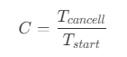
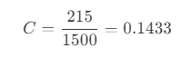

# Entendendo o Problema de Negócio  
Um **problema de negócio** refere-se a um **resultado indesejado em um processo**, que pode se manifestar como uma limitação, falha ou a consequência de uma série de eventos. Ao desenvolver um **modelo de aprendizado de máquina**, é crucial ter uma definição clara do problema de negócio. Sem um entendimento preciso, recursos podem ser desperdiçados, e a solução final pode falhar em abordar a questão central de maneira eficaz.  

### Qual é o Problema de Negócio neste Projeto?  
Este projeto aborda um problema de churn para uma instituição financeira que tem perdido um número significativo de clientes recentemente. O objetivo é prever quais clientes atuais têm mais probabilidade de ir para um concorrente e permitir intervenções personalizadas para evitar o churn.  

### O que é Churn?  
Conforme descrito anteriormente neste projeto, churn é uma métrica que mede o número de clientes que uma empresa perde durante um período específico. Esse período pode ser anual, semestral ou mensal. A taxa de churn é crítica para o fluxo de caixa de uma empresa, pois churn mais alto se traduz diretamente em redução de receita. Mesmo que a equipe de vendas alcance suas metas, churn alto pode desequilibrar o fluxo de caixa.  

Para calcular a taxa de churn (  ) para um período determinado, divida o número total de cancelamentos (  ) pelo número total de clientes no início do período (  ):

**Exemplo:**  
Uma empresa com 1.500 clientes no início do mês tem 215 cancelamentos no mesmo mês. Aplicando a fórmula, a taxa de churn para o mês é de 14,33%.  

 

Taxas de churn mais baixas indicam melhores esforços de retenção de clientes.  

### Por Que as Empresas Experimentam Churn?  
O churn geralmente resulta de:
- Estratégias comerciais desalinhadas ou funis de vendas que não abordam o verdadeiro perfil do cliente.
- Ações promocionais ineficazes devido à compreensão deficiente das necessidades do cliente.
- Falta de processos para monitorar a atividade do cliente em diversos pontos de contato, levando à negligência na relação empresa-cliente.  

### Como as Empresas Podem Reduzir o Churn?  
Para reduzir o churn, as empresas devem:
- Identificar as razões por trás dos cancelamentos.
- Focar nos grupos de clientes mais propensos a sair.
- Melhorar a experiência do cliente.
- Aumentar o valor percebido dos produtos ou serviços.
- Investir em gerenciamento de relacionamento com clientes para resolver problemas de forma rápida e eficaz.
- Alinhar as expectativas dos clientes com as entregas.  

### Como o Aprendizado de Máquina Pode Ajudar a Resolver Este Problema?  
O primeiro passo é coletar os dados dos clientes. Analisando esses dados, é possível identificar padrões para prever quais clientes têm probabilidade de churn com base no comportamento dos que já deram churn no passado. Para este projeto, os dados incluem informações comportamentais dos clientes dentro do banco (por exemplo, número de serviços usados, saldo de conta, atividade de cartão de crédito e status de conta).

Um modelo de aprendizado de máquina pode abordar este problema analisando esses padrões e prevendo potenciais churners, permitindo intervenções direcionadas. As etapas chave no desenvolvimento desta solução incluem:  

#### **1. Análise Exploratória de Dados (e Feature Engineering)**  
Nesta etapa, é realizada a análise exploratória de dados para entender melhor os dados e prepará-los para a modelagem. Isso envolve:
- Identificação de variáveis que são conceitualmente relevantes para o problema de negócio.
- Verificação de correlações e relações entre variáveis, especialmente com a variável alvo (status de churn).
- Exame da distribuição de cada variável.

o Feature Engineering transforma dados brutos em características significativas para melhorar o desempenho preditivo do modelo. Erros nos dados, como valores ausentes ou inconsistentes, também são identificados e corrigidos durante esta fase.  

#### **2. Análise do Melhor Modelo para Resolver o Problema**  
Para o problema de churn, um modelo de classificação é adequado. Opções populares incluem Regressão Logística, Árvores de Decisão, Random Forest, KNN e XGBoost. O objetivo é determinar qual modelo oferece o melhor desempenho para este problema específico.

Esta fase envolve testar diferentes modelos, ajustar hiperparâmetros (configurações específicas do modelo), e selecionar o modelo que oferece melhor equilíbrio de precisão e eficiência.

#### **3. Monitoramento e Avaliação do Modelo**  
Uma vez que o modelo de melhor desempenho é implantado, ele precisa de monitoramento contínuo para avaliar seu desempenho e fazer melhorias quando necessário. A implantação pode envolver integração com software existente ou desenvolvimento de um novo programa. Uma avaliação regular garante que o modelo permaneça eficaz à medida que os dados e condições de negócio evoluem.  

[<< Página Inicial do Projeto](README.md) | [Análise Exploratória de Dados >>](exploratory_analysis.ipynb)